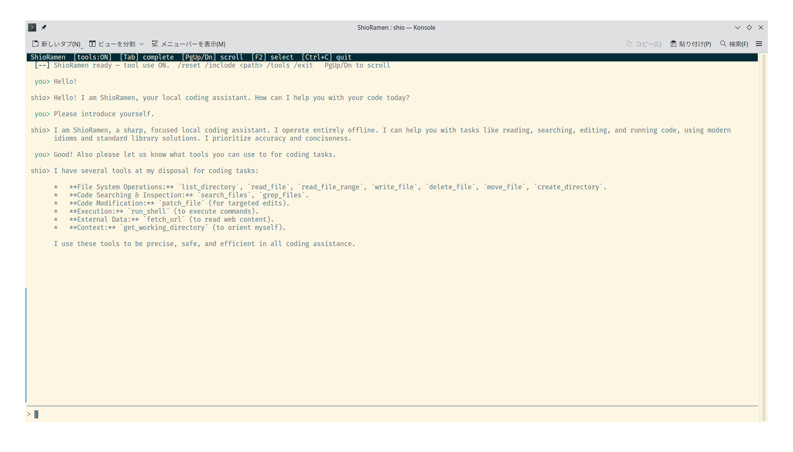

# ShioRamen 🍜

A local AI coding assistant powered by [llama.cpp](https://github.com/ggml-org/llama.cpp).
Runs entirely offline — no cloud API, no data leaving your machine.



## Features

- **`serve`** — launch `llama-server` and keep it running
- **`chat`** — full-screen TUI chat session (spawns the server automatically); tool use lets the model read/write files, run shell commands, search the web, save memory, and more
- **`ask`** — one-shot question with optional file context; streams answer to stdout
- **`edit`** — apply an AI-suggested edit to a file (shows diff, asks to confirm)
- **`pull`** — download GGUF models from HuggingFace or a direct URL
- **`doctor`** — check that all components are present and working
- **`init`** — scaffold a `shio.toml` config file in the current directory
- **`shio.toml`** — TOML config file; CLI flags always override it

---

## Requirements

- Rust (stable) — see [`rust-toolchain.toml`](rust-toolchain.toml)
- A built `llama-server` binary in `./bin/` (see [Build llama.cpp](#build-llamacpp))
- A GGUF model file (see [`shio pull`](#pull))
- NVIDIA GPU recommended; CPU-only works but is slow

---

## Installation

```bash
git clone --recurse-submodules https://github.com/hiroshiyui/ShioRamen.git
cd ShioRamen

# Build llama.cpp, copy binaries to ./bin/, and install shio in one step:
bash envsetup.sh

# Install the git pre-commit hook (fmt → clippy → test):
bash pre-commit.sh
```

`cargo install --path .` installs `shio` to `$HOME/.cargo/bin`.
`./bin/` is used only for `llama-server` and its shared libraries.

### Build llama.cpp

```bash
cd vendor/llama.cpp
cmake -B build \
  -DGGML_CUDA=ON \
  -DCMAKE_BUILD_TYPE=Release
cmake --build build --parallel
cp build/bin/llama-server ../../bin/
cd ../..
```

Omit `-DGGML_CUDA=ON` for CPU-only builds.

---

## Quick start

### 1. Download a model

```bash
# From HuggingFace (owner/repo/filename)
shio pull bartowski/Qwen2.5-Coder-7B-Instruct-GGUF/Qwen2.5-Coder-7B-Instruct-Q4_K_M.gguf

# From a direct URL
shio pull https://example.com/model.gguf
```

Models are saved to `./models/` by default.

### 2. Configure

Generate a starter config, then edit it to set your model path and tuning parameters:

```bash
shio init   # creates shio.toml in the current directory
```

```toml
[server]
bin  = "./bin/llama-server"
host = "127.0.0.1"
port = 8080
ngl  = 99      # GPU layers — set lower if VRAM is tight
ctx  = 8192    # Context window size

# Optional KV cache quantization (saves VRAM at a small quality cost)
cache_type_k = "q4_0"
cache_type_v = "q4_0"

flash_attn    = true
cont_batching = true

[chat]
model       = "./models/Qwen2.5-Coder-7B-Instruct-Q4_K_M.gguf"
temperature = 0.7   # 0.1–0.3 for coding; 0.7–1.0 for creative tasks

[paths]
models_dir = "./models"
```

### 3. Start chatting

```bash
# Launch server + open chat in one step
shio chat

# Or run server and chat separately
shio serve
shio chat --no-spawn   # connects to the already-running server
```

---

## Commands

### `serve`

Launch `llama-server` and keep it running until `Ctrl+C`.

```
shio serve [OPTIONS]

Options:
  -m, --model <MODEL>                GGUF model file  [config: chat.model]
      --server-bin <PATH>            llama-server binary  [default: ./bin/llama-server]
      --host <HOST>                  Bind host  [default: 127.0.0.1]
      --port <PORT>                  Bind port  [default: 8080]
      --ngl <N>                      GPU layers to offload  [default: 99]
      --ctx <N>                      Context window size  [default: 8192]
      --cache-type-k <TYPE>          KV cache type for keys (q4_0, q8_0, f16)
      --cache-type-v <TYPE>          KV cache type for values
      --flash-attn                   Enable flash attention
      --cont-batching                Enable continuous batching
```

### `chat`

Start an interactive chat session inside a full-screen TUI (spawns the server automatically unless `--no-spawn`).

```
shio chat [OPTIONS]

Options:
  -m, --model <MODEL>                GGUF model file  [config: chat.model]
      --no-spawn                     Connect to an already-running server
      --temp <TEMP>                  Sampling temperature  [default: 0.7]
      --no-tools                     Disable tool use for this session
      (all serve options also apply)
```

**TUI keybindings and commands:**

| Key / Command | Action |
|---------------|--------|
| `Enter` | Send message |
| `Alt+Enter` | Insert a literal newline (multi-line input) |
| `Esc` | Abort the current model turn (while model is thinking) |
| `Ctrl+C` / `Ctrl+D` | Quit |
| `PgUp` / `PgDn` | Scroll chat history up / down (10 lines) |
| `Up` / `Down` | Browse input history |
| `Left` / `Right` | Move cursor one character |
| `Ctrl+Left` / `Ctrl+Right` | Move cursor one word |
| `Home` / `End` | Move cursor to start / end of line |
| `Backspace` / `Delete` | Delete character before / after cursor |
| `Tab` | Cycle through slash-command or path completions |
| `F2` | Toggle select mode — disables mouse capture so you can drag-select and copy output text |
| `Ctrl+A` | Move cursor to beginning of line |
| `Ctrl+E` | Move cursor to end of line |
| `Ctrl+U` | Erase entire input line |
| `Ctrl+W` | Erase word before cursor |
| `/clear` / `/reset` | Clear conversation history (keeps system prompt) |
| `/stats` | Show server context usage (tokens used / available per slot) |
| `/include <path>` | Load a file or directory into context |
| `/tools` | List available tools |
| `/skills` | List defined custom skills |
| `/<skill-name> [args]` | Invoke a custom skill (defined in `shio.toml`) |
| `/exit` / `/quit` | Quit |

When the model requests a destructive action (writing a file or running a shell command), the status bar shows a `[y/N]` prompt. Press `y` to allow, or `n` / `Esc` / `Enter` to deny.

### `ask`

Ask a one-shot question; streams the answer to stdout.

```
shio ask <QUESTION> [OPTIONS]

Arguments:
  <QUESTION>   The question to ask

Options:
  -f, --file <PATH>                  File(s) to include as context (repeatable)
  -m, --model <MODEL>                GGUF model file  [config: chat.model]
      --temp <TEMP>                  Sampling temperature  [default: 0.7]
      --no-spawn                     Connect to an already-running server
      (all serve options also apply)
```

Example:

```bash
shio ask "what does this function do?" --file src/main.rs
```

### `edit`

Apply an AI-suggested edit to a file. Shows a coloured diff and asks to confirm before writing.

```
shio edit <FILE> <INSTRUCTION> [OPTIONS]

Arguments:
  <FILE>         File to edit
  <INSTRUCTION>  What to change (e.g. "add error handling to the parse function")

Options:
  -y, --yes                          Apply without asking for confirmation
  -m, --model <MODEL>                GGUF model file  [config: chat.model]
      --temp <TEMP>                  Sampling temperature  [default: 0.7]
      --no-spawn                     Connect to an already-running server
      (all serve options also apply)
```

Example:

```bash
shio edit src/main.rs "add a docstring to every public function"
```

### `pull`

Download a GGUF model from HuggingFace or a direct URL.

```
shio pull <SOURCE> [--models-dir <DIR>]
```

`SOURCE` can be:
- A HuggingFace path: `owner/repo/filename.gguf`
- A direct HTTPS URL: `https://…/filename.gguf`
- A HuggingFace web-page URL (the `/blob/main/` viewer URL is automatically rewritten to the direct download URL)

Downloads are saved to `./models/` (or `paths.models_dir` from config).
Already-downloaded files are skipped.

### `doctor`

Check that all required components are present and working.

```
shio doctor [OPTIONS]

  -m, --model <MODEL>        GGUF model file to verify  [config: chat.model]
      --server-bin <PATH>    llama-server binary to check  [default: ./bin/llama-server]
      --host <HOST>          Server host to probe  [default: 127.0.0.1]
      --port <PORT>          Server port to probe  [default: 8080]
```

Example output:

```
🩺 Checking components…

  ✅  llama-server binary: ./bin/llama-server
  ✅  Model file: ./models/gemma4-26b-q4_k_m.gguf (14.9 GB)
  🔍  GPU (NVIDIA): NVIDIA GeForce RTX 3060, 12288 MiB
  ✅  Server health: http://127.0.0.1:8080

🎉  All checks passed.
```

### `init`

Create a `shio.toml` config file with all options documented and commented out.

```
shio init
```

Errors if `shio.toml` already exists in the current directory.

---

## Config file reference (`shio.toml`)

All settings are optional. CLI flags always take precedence over the config file.

```toml
[server]
bin           = "./bin/llama-server"   # path to llama-server binary
host          = "127.0.0.1"
port          = 8080
ngl           = 99                     # GPU layers to offload
ctx           = 8192                   # context window (tokens)
cache_type_k  = "q4_0"                 # KV key cache quantization
cache_type_v  = "q4_0"                 # KV value cache quantization
flash_attn    = true
cont_batching = true

[chat]
model         = "./models/model.gguf"
temperature   = 0.7
system_prompt = "..."                  # optional: override the built-in system prompt

[paths]
models_dir    = "./models"             # default download directory for `shio pull`

[tools]
enabled        = true   # let the model read/write files and run commands
confirm_writes = true   # ask [y/N] before the model writes files
confirm_shell  = true   # ask [y/N] before the model runs shell commands

[lsp.servers]
rust   = "rust-analyzer"                        # language name → LSP server command
python = "pylsp"
ts     = "typescript-language-server --stdio"

[skills.commit]
description = "Write a conventional git commit message"   # shown by /skills
prompt      = "Write a conventional git commit message for the staged changes."

[skills.review]
description = "Review code for correctness and style"
prompt      = "Review this for correctness, edge cases, and style: {args}"   # {args} = text after skill name
```

A custom config file can be specified with the global `--config` flag:

```bash
shio --config /path/to/other.toml serve
```

---

## Development

```bash
cargo build            # debug build
cargo test             # run tests
cargo clippy           # lint
cargo install --path . # install shio to $HOME/.cargo/bin
```

---

## License

[GPL-3.0-or-later](LICENSE)
