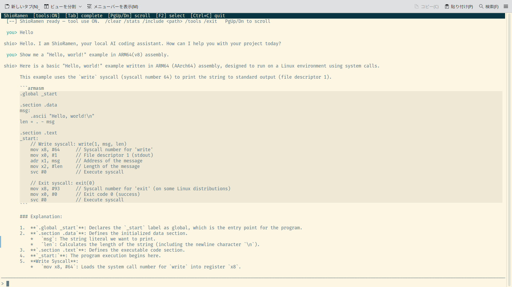

# ShioRamen 🍜

A local AI coding assistant powered by [llama.cpp](https://github.com/ggml-org/llama.cpp).
Runs entirely offline — no cloud API, no data leaving your machine.



## Features

- **`serve`** — launch `llama-server` and keep it running
- **`chat`** — full-screen TUI chat session (spawns the server automatically); tool use lets the model read/write files, run shell commands, search the web, save memory, and more
- **`ask`** — one-shot question with optional file context; streams answer to stdout
- **`edit`** — apply an AI-suggested edit to a file (shows diff, asks to confirm)
- **`pull`** — download GGUF models from HuggingFace or a direct URL
- **`doctor`** — check that all components are present and working
- **`init`** — scaffold a `shio.toml` config file in the current directory
- **`shio.toml`** — TOML config file; CLI flags always override it

---

## Requirements

- Rust (stable) — see [`rust-toolchain.toml`](rust-toolchain.toml)
- Ruby + rake (for building the embedded mRuby VM — `rake` must be on `$PATH`)
- A built `llama-server` binary in `./bin/` (see [Build llama.cpp](#build-llamacpp))
- A GGUF model file (see [`shio pull`](#pull))
- NVIDIA GPU recommended; CPU-only works but is slow

---

## Installation

```bash
git clone --recurse-submodules https://github.com/hiroshiyui/ShioRamen.git
cd ShioRamen

# Build llama.cpp, copy binaries to ./bin/, and install shio in one step:
bash envsetup.sh

# Install the git pre-commit hook (fmt → clippy → test):
bash pre-commit.sh
```

`cargo install --path .` installs `shio` to `$HOME/.cargo/bin`.
`./bin/` is used only for `llama-server` and its shared libraries.

### Build llama.cpp

```bash
cd vendor/llama.cpp
cmake -B build \
  -DGGML_CUDA=ON \
  -DCMAKE_BUILD_TYPE=Release
cmake --build build --parallel
cp build/bin/llama-server ../../bin/
cd ../..
```

Omit `-DGGML_CUDA=ON` for CPU-only builds.

---

## Quick start

### 1. Download a model

```bash
# From HuggingFace (owner/repo/filename)
shio pull bartowski/Qwen2.5-Coder-7B-Instruct-GGUF/Qwen2.5-Coder-7B-Instruct-Q4_K_M.gguf

# From a direct URL
shio pull https://example.com/model.gguf
```

Models are saved to `./models/` by default.

### 2. Configure

Generate a starter config, then edit it to set your model path and tuning parameters:

```bash
shio init   # creates shio.toml in the current directory
```

```toml
[server]
bin  = "./bin/llama-server"
host = "127.0.0.1"
port = 8080
ngl  = 99      # GPU layers — set lower if VRAM is tight
ctx  = 8192    # Context window size

# Optional KV cache quantization (saves VRAM at a small quality cost)
cache_type_k = "q4_0"
cache_type_v = "q4_0"

flash_attn    = true
cont_batching = true
# mmproj      = "./models/mmproj.gguf"  # multimodal projector for vision models

[chat]
model       = "./models/Qwen2.5-Coder-7B-Instruct-Q4_K_M.gguf"
temperature = 0.7   # 0.1–0.3 for coding; 0.7–1.0 for creative tasks
# top_p          = 0.95   # nucleus sampling — lower values focus on top tokens
# min_p          = 0.05   # quality floor; pairs well with higher temperature on long contexts
# repeat_penalty = 1.1    # > 1.0 discourages repetition
# n_keep         = -1     # tokens to retain on context shift; -1 keeps the full initial prompt

[paths]
models_dir = "./models"
```

### 3. Start chatting

```bash
# Launch server + open chat in one step
shio chat

# Or run server and chat separately
shio serve
shio chat --no-spawn   # connects to the already-running server
```

---

## Commands

### `serve`

Launch `llama-server` and keep it running until `Ctrl+C`.

```
shio serve [OPTIONS]

Options:
  -m, --model <MODEL>                GGUF model file  [config: chat.model]
      --server-bin <PATH>            llama-server binary  [default: ./bin/llama-server]
      --host <HOST>                  Bind host  [default: 127.0.0.1]
      --port <PORT>                  Bind port  [default: 8080]
      --ngl <N>                      GPU layers to offload  [default: 99]
      --ctx <N>                      Context window size  [default: 8192]
      --cache-type-k <TYPE>          KV cache type for keys (q4_0, q8_0, f16)
      --cache-type-v <TYPE>          KV cache type for values
      --flash-attn                   Enable flash attention
      --cont-batching                Enable continuous batching
      --mmproj <PATH>                Multimodal projector GGUF for vision models
```

### `chat`

Start an interactive chat session inside a full-screen TUI (spawns the server automatically unless `--no-spawn`).

```
shio chat [OPTIONS]

Options:
  -m, --model <MODEL>                GGUF model file  [config: chat.model]
      --no-spawn                     Connect to an already-running server
      --temp <TEMP>                  Sampling temperature  [default: 0.7]
      --top-p <P>                    Top-p (nucleus) sampling  [config: chat.top_p]
      --min-p <P>                    Min-p sampling — quality floor  [config: chat.min_p]
      --repeat-penalty <P>           Repetition penalty (> 1.0)  [config: chat.repeat_penalty]
      --keep <N>                     Prompt tokens to retain on context shift; -1 = all  [config: chat.n_keep]
      --no-tools                     Disable tool use for this session
      --resume                       Resume the most recent saved session
      (all serve options also apply)
```

**TUI keybindings and commands:**

| Key / Command | Action |
|---------------|--------|
| `Enter` | Send message |
| `Alt+Enter` / `Shift+Enter` / `Ctrl+J` | Insert a literal newline (multi-line input) |
| `Ctrl+V` | Paste from clipboard (text or image) |
| `Esc` | Abort the current model turn (while model is thinking) |
| `Ctrl+C` / `Ctrl+D` | Quit |
| `PgUp` / `PgDn` | Scroll chat history up / down (10 lines) |
| `Up` / `Down` | Browse input history |
| `Left` / `Right` | Move cursor one character |
| `Ctrl+Left` / `Ctrl+Right` | Move cursor one word |
| `Home` / `End` | Move cursor to start / end of line |
| `Backspace` / `Delete` | Delete character before / after cursor |
| `Tab` | Cycle through slash-command or path completions |
| `F2` | Toggle select mode — disables mouse capture so you can drag-select and copy output text |
| `Ctrl+A` | Move cursor to beginning of line |
| `Ctrl+E` | Move cursor to end of line |
| `Ctrl+U` | Erase entire input line |
| `Ctrl+W` | Erase word before cursor |
| `/clear` / `/reset` | Clear conversation history (keeps system prompt) |
| `/new` | Clear history *and* delete the auto-saved session file |
| `/resume` | Reload the most recent saved session |
| `/compact` | Summarise older history to free up context |
| `/stats` | Show server context usage (tokens used / available per slot) |
| `/model` | Show the model currently loaded by `llama-server` |
| `/include <path>` | Load a file or directory into context |
| `/tools` | List available tools |
| `/skills` | List defined custom skills |
| `/record [path]` | Start archiving the chat to a file (default under `$XDG_DATA_HOME/shio/recordings/`) |
| `/stop-record` | Stop the current recording |
| `/<skill-name> [args]` | Invoke a custom skill (defined in `shio.toml`) |
| `/exit` / `/quit` | Quit |

When the model requests a destructive action (writing a file or running a shell command), the status bar shows a `[y/N]` prompt. Press `y` to allow, or `n` / `Esc` / `Enter` to deny.

### `ask`

Ask a one-shot question; streams the answer to stdout.

```
shio ask <QUESTION> [OPTIONS]

Arguments:
  <QUESTION>   The question to ask

Options:
  -f, --file <PATH>                  File(s) to include as context (repeatable)
  -m, --model <MODEL>                GGUF model file  [config: chat.model]
      --temp <TEMP>                  Sampling temperature  [default: 0.7]
      --top-p <P>                    Top-p (nucleus) sampling  [config: chat.top_p]
      --min-p <P>                    Min-p sampling — quality floor  [config: chat.min_p]
      --repeat-penalty <P>           Repetition penalty (> 1.0)  [config: chat.repeat_penalty]
      --keep <N>                     Prompt tokens to retain on context shift; -1 = all  [config: chat.n_keep]
      --no-spawn                     Connect to an already-running server
      (all serve options also apply)
```

Example:

```bash
shio ask "what does this function do?" --file src/main.rs
```

### `edit`

Apply an AI-suggested edit to a file. Shows a coloured diff and asks to confirm before writing.

```
shio edit <FILE> <INSTRUCTION> [OPTIONS]

Arguments:
  <FILE>         File to edit
  <INSTRUCTION>  What to change (e.g. "add error handling to the parse function")

Options:
  -y, --yes                          Apply without asking for confirmation
  -m, --model <MODEL>                GGUF model file  [config: chat.model]
      --temp <TEMP>                  Sampling temperature  [default: 0.7]
      --top-p <P>                    Top-p (nucleus) sampling  [config: chat.top_p]
      --min-p <P>                    Min-p sampling — quality floor  [config: chat.min_p]
      --repeat-penalty <P>           Repetition penalty (> 1.0)  [config: chat.repeat_penalty]
      --keep <N>                     Prompt tokens to retain on context shift; -1 = all  [config: chat.n_keep]
      --no-spawn                     Connect to an already-running server
      (all serve options also apply)
```

Example:

```bash
shio edit src/main.rs "add a docstring to every public function"
```

### `pull`

Download a GGUF model from HuggingFace or a direct URL.

```
shio pull <SOURCE> [--models-dir <DIR>]
```

`SOURCE` can be:
- A HuggingFace path: `owner/repo/filename.gguf`
- A direct HTTPS URL: `https://…/filename.gguf`
- A HuggingFace web-page URL (the `/blob/main/` viewer URL is automatically rewritten to the direct download URL)

Downloads are saved to `./models/` (or `paths.models_dir` from config).
Already-downloaded files are skipped.

### `doctor`

Check that all required components are present and working.

```
shio doctor [OPTIONS]

Options:
  -m, --model <MODEL>        GGUF model file to verify  [config: chat.model]
      --server-bin <PATH>    llama-server binary to check  [default: ./bin/llama-server]
      --host <HOST>          Server host to probe  [default: 127.0.0.1]
      --port <PORT>          Server port to probe  [default: 8080]
```

Example output:

```
🩺 Checking components…

  ✅  llama-server binary: ./bin/llama-server
  ✅  Model file: ./models/gemma4-26b-q4_k_m.gguf (14.9 GB)
  🔍  GPU (NVIDIA): NVIDIA GeForce RTX 3060, 12288 MiB
  ✅  Server health: http://127.0.0.1:8080

🎉  All checks passed.
```

### `init`

Create a `shio.toml` config file with all options documented and commented out.

```
shio init
```

Errors if `shio.toml` already exists in the current directory.

---

## Config file reference (`shio.toml`)

All settings are optional (except `chat.model`, which has no sensible
fallback).  CLI flags always take precedence over the config file.

In the reference block below, the trailing comment on each line tells you
what happens when the key is omitted:

- **`default`** — Shio's built-in value.  Listing the key explicitly is a
  no-op; you can safely delete it.
- **`recommended`** — a non-default value worth setting explicitly.  The
  code falls back to something more conservative when the key is omitted.
- **`optional`** — Shio omits the key from the request when unset, letting
  `llama-server` use its own internal default (which is usually fine).
  Listing the key lets you pin it across llama-server upgrades.
- **`required`** — no default; Shio errors out if you don't provide it.

```toml
[server]
bin           = "./bin/llama-server"    # default — path to llama-server binary
host          = "127.0.0.1"             # default
port          = 8080                    # default
ngl           = 99                      # default — GPU layers to offload
ctx           = 8192                    # default — context window (tokens)
cache_type_k  = "q4_0"                  # recommended (default: f16 — saves VRAM at ~1% quality cost)
cache_type_v  = "q4_0"                  # recommended (default: f16)
flash_attn    = true                    # recommended (default: false)
cont_batching = true                    # recommended (default: false — required for concurrent clients e.g. Continue.dev)
mmproj        = "./models/mmproj.gguf"  # optional — multimodal projector for vision models

[chat]
model          = "./models/model.gguf"  # required — no default
temperature    = 0.7                    # default
top_p          = 0.95                   # optional — unset means llama-server's internal default (currently 0.95)
min_p          = 0.05                   # optional — quality floor (drop tokens below `min_p * p_max`); unset means llama-server's default
repeat_penalty = 1.1                    # optional — unset means llama-server's internal default (currently 1.1)
n_keep         = -1                     # optional — prompt tokens to retain on context shift; -1 keeps the full initial prompt
show_thinking  = true                   # default — show <think>…</think> blocks from reasoning models (dimmed)
prompt_style   = "auto"                 # default — "auto" detects from model size; or "full" / "concise" / "minimal"
system_prompt  = "..."                  # optional — override the built-in prompt (disables prompt_style)

[paths]
models_dir    = "./models"              # default — download directory for `shio pull`

[tools]
enabled        = true                   # default — let the model read/write files and run commands
confirm_writes = true                   # default — ask [y/N] before the model writes files
confirm_shell  = true                   # default — ask [y/N] before the model runs shell commands

# Shell command sandboxing (optional — both empty = unrestricted)
# shell_allowlist = ["cargo", "git", "grep", "ls"]   # only these commands allowed
# shell_denylist  = ["rm", "curl", "wget", "ssh"]    # these commands always blocked

[lsp.servers]                           # optional — map language or file extension to an LSP command
rust   = "rust-analyzer"
python = "pylsp"
ts     = "typescript-language-server --stdio"

[skills.commit]                         # optional — define named prompt templates invokable as /commit etc.
description = "Write a conventional git commit message"   # shown by /skills
prompt      = "Write a conventional git commit message for the staged changes."

[skills.review]
description = "Review code for correctness and style"
prompt      = "Review this for correctness, edge cases, and style: {args}"   # {args} = text after skill name
```

A custom config file can be specified with the global `--config` flag:

```bash
shio --config /path/to/other.toml serve
```

---

## Integrate with Continue.dev

[Continue.dev](https://www.continue.dev/) is a VS Code / JetBrains extension
that provides AI chat and inline tab-autocomplete.  Because `shio serve`
launches `llama-server` on an OpenAI-compatible endpoint, Continue can talk
to it as a local model — no cloud API, no data leaving your machine.

### 1. Enable continuous batching in `shio.toml`

Before starting the server, make sure continuous batching is on.  Without
it, `llama-server` processes requests strictly FIFO — a long chat answer
will block every autocomplete request that fires while it's streaming, and
autocomplete will feel dead until the chat finishes.  With it, Continue's
chat and autocomplete streams get independent KV-cache slots and interleave
on the GPU, so both stay responsive at the cost of a small amount of extra
VRAM:

```toml
[server]
cont_batching = true
```

The same effect can be had one-off via `shio serve --cont-batching`, but
since you'll be running the server all day as a VS Code backend, setting
it in the config file is the saner ergonomics.

### 2. Start Shio as a server

Run `serve` (not `chat`) in a dedicated terminal so it stays up for as long
as VS Code needs it:

```bash
shio serve
```

Pick a code-capable, FIM (fill-in-middle) trained model for good
autocomplete quality.  `Qwen2.5-Coder-7B-Instruct` and
`DeepSeek-Coder-V2-Lite-Instruct` are both solid choices.

### 3. Drop this into `~/.continue/config.yaml`

```yaml
name: Shio Local
version: 0.0.1
schema: v1

models:
  - name: Shio Chat
    provider: openai
    model: local
    apiBase: http://127.0.0.1:8080/v1
    apiKey: dummy-key-ignored-by-llama-server
    roles:
      - chat
      - edit
      - apply
    defaultCompletionOptions:
      contextLength: 8192
      maxTokens: 2048
      temperature: 0.3

  - name: Shio Autocomplete
    provider: openai
    model: local
    apiBase: http://127.0.0.1:8080/v1
    apiKey: dummy-key-ignored-by-llama-server
    roles:
      - autocomplete
    defaultCompletionOptions:
      contextLength: 8192
      maxTokens: 256
      temperature: 0.1

context:
  - provider: file
  - provider: code
  - provider: diff
  - provider: terminal
  - provider: problems
  - provider: currentFile
  - provider: docs
```

Match `contextLength` on both models to the `--ctx` you gave `shio serve`
(default `8192`).  Setting it lower wastes capacity; setting it higher
silently truncates on the server side.

> **Older Continue versions** used `~/.continue/config.json` instead.
> The same fields apply — wrap chat models in a `models: [...]` array
> and put autocomplete under a top-level `tabAutocompleteModel` object.

### 4. (Optional) Run two servers for fast autocomplete

A single 7B model handling both chat and autocomplete works, but
autocomplete feels much snappier with a smaller dedicated model.  If your
GPU has the VRAM, run two `shio serve` instances on different ports:

```bash
# Terminal 1 — chat model on :8080
shio serve --model ./models/Qwen2.5-Coder-7B-Instruct-Q4_K_M.gguf \
  --port 8080 --ngl 99 --ctx 16384 --cont-batching

# Terminal 2 — small fast completion model on :8081
shio serve --model ./models/Qwen2.5-Coder-1.5B-Q4_K_M.gguf \
  --port 8081 --ngl 99 --ctx 4096 --cont-batching
```

Then change the `apiBase` of the `Shio Autocomplete` model in your
Continue config to `http://127.0.0.1:8081/v1`.

### Verifying it works

1. Reload VS Code after editing `config.yaml`.
2. Open Continue's sidebar (Cmd/Ctrl-L), type a question about an open
   file, and send.  You should see tokens streaming in both the sidebar
   and the `llama-server` request log in your terminal.
3. Start typing a function signature in a code file — gray-text
   suggestions should appear after a brief debounce.

If chat works but autocomplete doesn't, the usual culprit is a FIM template
mismatch.  Try switching just the autocomplete model's `provider` from
`openai` to `llama.cpp` (Continue has a dedicated provider with native
support for `llama-server`'s infill endpoint).

---

## Development

```bash
cargo build            # debug build
cargo test             # run tests
cargo clippy           # lint
cargo install --path . # install shio to $HOME/.cargo/bin
```

---

## License

[GPL-3.0-or-later](LICENSE)
